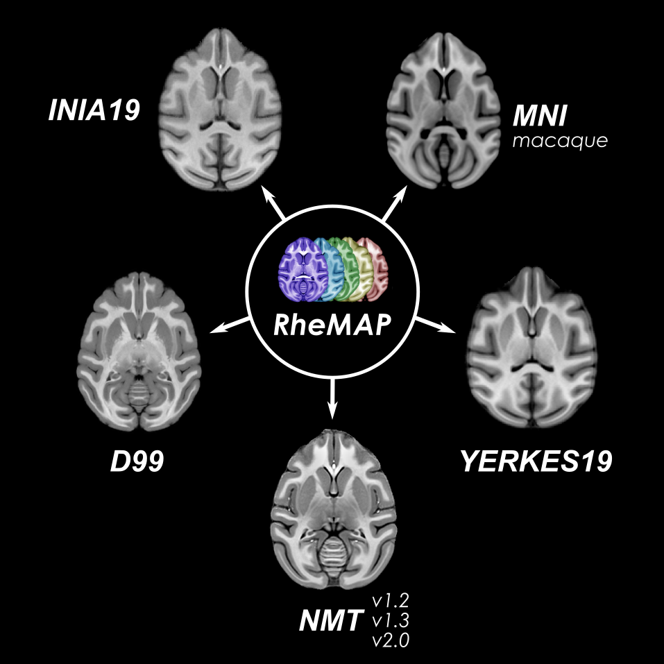
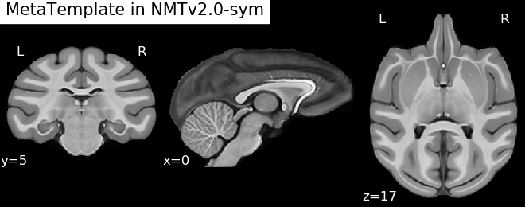

<!---->

# RheMAP
The RheMAP project provides access to a set of pre-calculated non-linear registrations between some of the most commonly used rhesus macaque brain templates (D99, INIA19, MNI macaque, NMT, Yerkes19). This repository contains the code used to calculate the registration warps and example code that demonstrates how to use the resulting warp files to remap data between different template spaces. Non-linear registration warps were generated using [ANTs](http://stnava.github.io/ANTs/) and can directly be downloaded from Zenodo: 
     

**Authors**:     
[Nikoloz Sirmpilatze](https://github.com/niksirbi) (German Primate Center)     
[Chris Klink](https://github.com/pcklink) (Netherlands Institute for Neuroscience)

**Contact**:
Join our channel on 

**Citation**:     
Sirmpilatze, Nikoloz and Klink, P. Christiaan (2020). RheMAP: Non-linear warps between common rhesus macaque brain templates (Version 1.3)[Data set]. Zenodo. https://doi.org/10.5281/zenodo.4748589         

# Rationale
For human MRI, the [MNI template](http://www.bic.mni.mcgill.ca/ServicesAtlases/ICBM152NLin2009) serves as the community standard volumetric template. Its integration into most major software packages makes it easy for researchers to register their results to MNI space. This facilitates data-sharing, cross-study comparisons and metanalyses. Most human brain atlases (parcellations) are also provided in MNI space. For surface-based analysis, the [FsAverage](https://surfer.nmr.mgh.harvard.edu/fswiki/FsAverage) (freesurfer average) template serves the same purpose.

For macaque MRI, multiple templates are currently available (see table below for a non-exhaustive list), but there is no universally adopted community standard template. With the increasing presence of data sharing initiatives like [PRIME-DE](http://fcon_1000.projects.nitrc.org/indi/indiPRIME.html), it is becoming much more feasible to obtain larger sample sizes on non-human MRI data. The lack of a broadly adopted standard space can however make it necessary to warp different datasets to a common standard space before they can be combined or compared. Since the generation of non-linear registrations between different brains or template spaces is a timely and computationally heavy operation, we have created a set of non-linear registration warps that allow the direct remapping of (f)MRI data across different common template brains.

We include the following templates and used [ANTs](http://stnava.github.io/ANTs/) to compute the non-linear transformation warps between their volumetric spaces.     

| Template | Species | Resolution (mm3) | With atlas | Volume format | Surface format | Links |
| --- | --- | --- | --- | --- | --- | --- |
| NMT v1.2/v1.3/v2.0 | _M. mulatta_ | 0.25 | Saleem Logothetis (D99-SL) | NIFTI | GIFTI | [reference](https://www.ncbi.nlm.nih.gov/pmc/articles/PMC5660669/) [download](https://afni.nimh.nih.gov/pub/dist/doc/htmldoc/nonhuman/macaque_tempatl/main_toc.html) |
| D99 | _M. mulatta_ | 0.25 | D99-SL | NIFTI | GIFTI | [reference](https://www.ncbi.nlm.nih.gov/pmc/articles/PMC6075609/) [download](https://afni.nimh.nih.gov/Macaque) |
| INIA19 | _M. mulatta_ | 0.50 | Neuromaps | NIFTI | N/A | [reference](https://www.ncbi.nlm.nih.gov/pmc/articles/PMC3515865/) [download](https://www.nitrc.org/projects/inia19/https://www.nitrc.org/projects/inia19/) |
| MNI macaque | _M. fascicularis_ & _M. mulatta_ | 0.25 | Paxinos | MINC & NIFTI | N/A | [reference](https://www.ncbi.nlm.nih.gov/pubmed/21256229) [download](http://www.bic.mni.mcgill.ca/ServicesAtlases/Macaque) |
| ONPRC18 | _M. mulatta_ | 0.50 | D99-SL | NIFTI | N/A | [reference](https://doi.org/10.1016/j.neuroimage.2020.117517) [download](https://www.nitrc.org/projects/onprc18_atlas) |
| Yerkes19 | _M. mulatta_ | 0.50 | F99 | NIFTI | GIFTI & MGZ | [reference1](https://www.pnas.org/content/115/22/E5183) [reference2](https://www.ncbi.nlm.nih.gov/pmc/articles/PMC3500860/) [download1](https://balsa.wustl.edu/reference/show/976nz) [download2](https://github.com/Washington-University/NHPPipelines) |

[Jupyter](https://jupyter.org/) notebooks are provided here as guides to explain:    
1. [How template warps were computed](notebooks/macaque_template_warps.ipynb)    
2. [How the warps can be used](notebooks/how_to_apply_template_warps.ipynb) to transform data (parcellations, statistical maps etc.) between template spaces.     
3. [How to warp individual subject anatomy to templates](notebooks/warp_individual_to_templates.ipynb)

We do not provide copies of the actual templates (licenses often forbids redistribution), but instead suggest you follow the links above and get them at the source. We do offer the warp files and warped templates that will be produced by this workflow. They can be downloaded from Zenodo (DOI:10.5281/zenodo.4748589). For optimal compatibility, you could [set up your template folder structure like this](template_dir_tree.md). If you really want to, you can [reconstruct the original templates](reconstruct_templates.md) with these warped templates and warp files as well.

**NB!** With the provided code, the set of warp files can easily be expanded to include additional template brains.

# RheMAP results / Quality control
These images (generated in the [template_warps notebook](notebooks/macaque_template_warps.ipynb)) demonstrate the differences between the original templates, the linear alignment, and the final non-linear registrations between templates ([go directly to end result](all_warp_pairs.md)).    
* [Original templates](templates.md)   
* [Linearly aligned](linear_alignment.md)
* [Non-linear registration (composite warps)](nonlinear_registration.md)
* [Final registrations between all template pairs](all_warp_pairs.md)

# Average template    
Now that all templates can be warped to all standard spaces, we can also average them and create a 'MetaTemplate'. This isn't particularly useful, but it does show that we have good cross-template registration.    

 

---

This repository is archived in Zenodo: 

